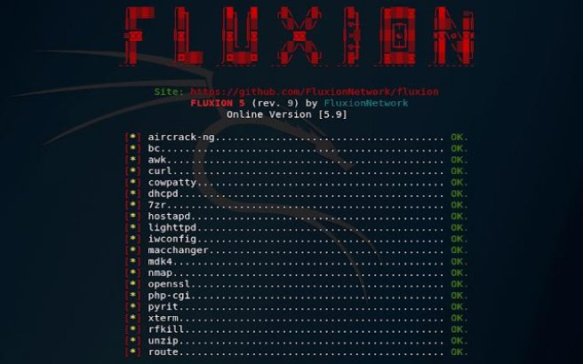
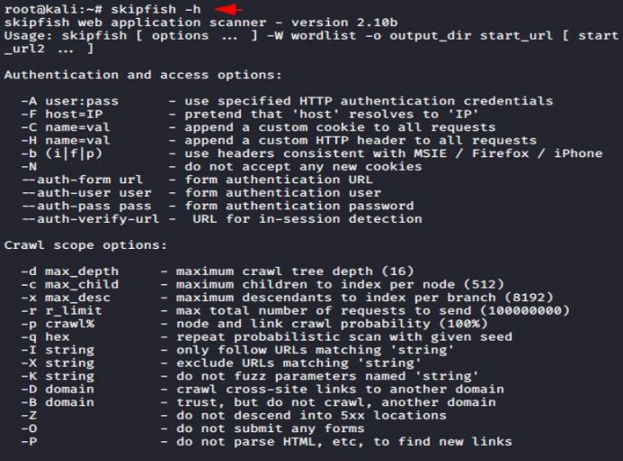

5 Rarest Tools used in Linux :- 

1. FLUXION 
1. LYNIS 
1. NIKTO 
1. SKIPFISH 
1. JOHN THE RIPPER 
1. **FLUXION** 

Fluxion is a Wi-Fi analyzer specializing in MITM WPA attacks and lets you scan wireless networks. 

Pen testers use Fluxion to search for security flaws in corporate and personal networks. However, unlike similar Wi-Fi cracking tools, Fluxion does not launch time-consuming brute force cracking attempts. 

Instead, Fluxion creates an MDK3 process that forces all users on the targeted network to lose authentication or deauthenticate. Once this is accomplished, the user is prompted to connect to a false access point, requiring entering the Wi-Fi password. Then, the program reports the password to the pen tester to gain access. 

2. **LYNIS** 

Lynis is most likely one of the most comprehensive tools available for cybersecurity compliance (e.g., PCI,  HIPAA), system auditing, system hardening, and testing. In addition, thanks to its numerous capabilities, Lynis also functions as an effective platform for vulnerability scanning and penetration testing. 

This Kali Linux tool’s main features include: 

Open source and free, with commercial support 

available. Simple installation from the Github 

repository. 

It runs on multiple platforms (BSD, macOS, Linux, 

BSD, AIX, and more). It can run up to 300 security tests 

on the remote host. 

Its output report is shared on-screen and features suggestions, warnings, and any critical security issues found on the machine. 

3. **NIKTO** 

Nikto enables ethical hackers and pen testers to conduct a complete web server scan to discover security vulnerabilities and related flaws. This scan collects results by detecting default file names, insecure file and app patterns, outdated server software, and server and software misconfigurations. 

Written in Perl, Nikto complements OpenVAS and other vulnerability scanners. In addition, it features support for host-based authentication, proxies, SSL encryption, and more. 

Nikto’s primary features include: 

Scanning multiple ports on 

a server. Providing IDS 

evasion techniques. 

Outputting results into TXT, XML, HTML, NBE or CSV. Apache and cgiwrap username enumeration. 

Identifying installed software via headers, files, and favicons. Scanning specified CGI directories. 

Using custom configuration files. 

4. **SKIPFISH** 

Skipfish is a Kali Linux tool like WPScan, but instead of only focusing on WordPress, Skipfish scans many web applications. Skipfish acts as an effective auditing tool for crawling web-based data, giving pen testers a quick insight into how insecure any app is. 

Skipfish performs recursive crawl and dictionary-based tests over all URLs, using its recon capabilities. The crawl creates a digital map of security checks and their results. 

Noteworthy Skipfish features include: 

Automated learning 

capabilities. Differential 

security checks. 

Easy to use. 

A low false positive ratio. 

`  `The ability to run high-speed security checks, with over 200 requests per second.

5. **JOHN THE RIPPER** 

John the Ripper gets points for a creative name. This hacker’s resource is a multi-platform cryptography testing tool that works equally well on Linux, Windows, macOS, and Unix. It enables system administrators and security penetration testers to test the strength of any system password by launching brute force attacks. Additionally, John the Ripper can be used to test encryptions like DES, SHA-1, and many others. 

Its ability to change password decryption methods is set automatically and contingent on the detected algorithms. 

John the Ripper’s advantages : 

BruteForce and Dictionary attacks 

Compatibility with most operating systems and CPU architectures 

` `Running automatically by using crons 

Allowing Pause and Resume options for any scan 

It lets hackers define custom letters while building dictionary attack lists  

It allows brute force customization rules 

